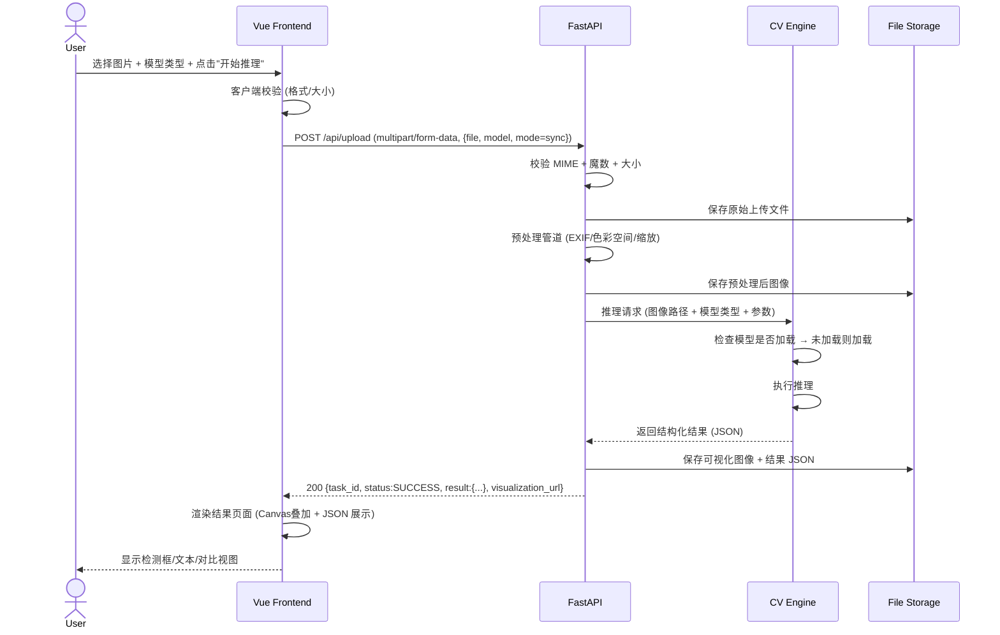
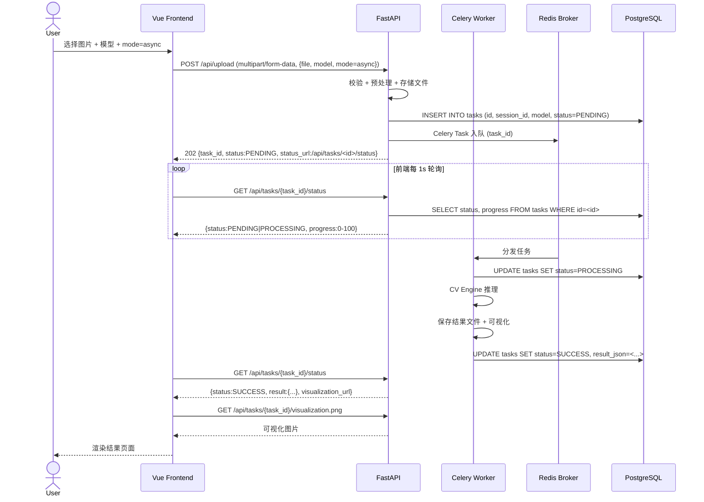
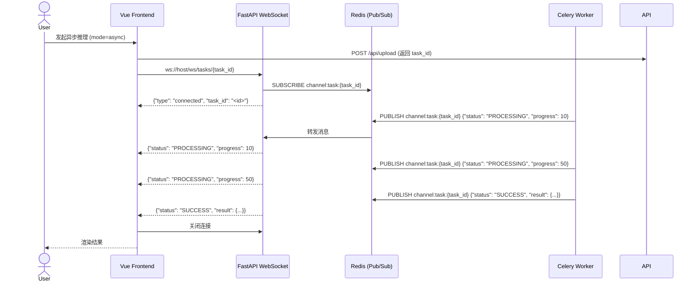
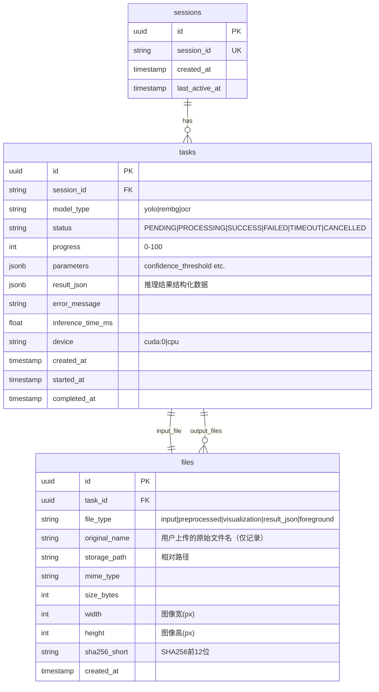
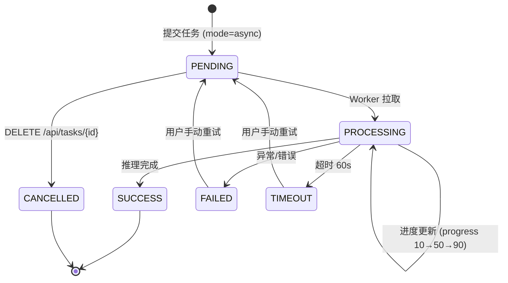

# AI-Vision-Studio（AI视觉工作台）产品需求文档

> **版本**：v1.0 | **日期**：2026-05-25 | **作者**：AI-Vision-Studio 架构组
> **文档状态**：Draft → Review → Approved

---

## 目录

1. [项目概述](#1-项目概述)
2. [角色与权限](#2-角色与权限)
3. [功能需求清单](#3-功能需求清单)
4. [非功能需求](#4-非功能需求)
5. [系统架构与数据流](#5-系统架构与数据流)
6. [核心API设计](#6-核心api设计)
7. [前端交互规范](#7-前端交互规范)
8. [开发与部署规范](#8-开发与部署规范)
9. [迭代路线图](#9-迭代路线图)
10. [风险与应对](#10-风险与应对)

---

## 1. 项目概述

### 1.1 项目背景

AI-Vision-Studio 是一个轻量级计算机视觉全栈工作台，面向个人开发者与技术学习场景。用户在 Web 界面中上传图像后，可选择目标检测（YOLOv8n）、背景移除（rembg）、文字识别（PaddleOCR）三种 CV 能力进行推理，结果以可视化叠加、结构化 JSON、原始文件三种形式呈现。系统支持同步/异步两种推理模式，并提供任务历史追溯与进度实时反馈。

### 1.2 核心目标

| 目标 | 衡量标准 |
|------|----------|
| 提供完整的 CV 推理全链路体验 | 上传 → 预处理 → 推理 → 可视化 → 结果下载 五步闭环 |
| 作为个人技术作品集的核心项目 | README 包含架构图、API 文档、一键启动、Docker 编排 |
| 工程化落地能力展示 | pyproject.toml、类型标注、单元/集成测试、CI/CD |
| 低门槛本地部署 | `docker compose up` 一条命令启动全栈 |

### 1.3 差异化价值

- **非商业 SaaS 定位**：不做多租户、不做计费、不做强鉴权，聚焦技术实现完整性
- **三种 CV 模型统一编排**：同一套上传-推理-可视化管道支持三种异构模型
- **工程化 infra 比模型本身更重**：Celery 任务队列、WebSocket 进度推送、容器化部署、自动化测试，展示全栈工程能力

### 1.4 典型使用场景

| 场景 | 用户操作路径 |
|------|------------|
| 目标检测演示 | 上传街景照片 → 选择 YOLOv8n → 查看检测框叠加图 + JSON 坐标 |
| 人像背景移除 | 上传人像 → 选择 rembg → 下载透明 PNG + 预览对比 |
| 文档 OCR | 上传扫描件/截图 → 选择 PaddleOCR → 获取结构化文本区域 JSON + 可视化框 |

---

## 2. 角色与权限

### 2.1 角色定义

| 角色 | 权限范围 | 鉴权方式 |
|------|---------|---------|
| **访客（Guest）** | 上传图像、执行推理、查看/下载结果、查看历史（仅当前浏览器会话） | 无需登录，基于浏览器会话标识（session_id cookie）隔离 |
| **注册用户（User）** | 访客全部权限 + 持久化历史记录、任务重跑、批量删除 | 可选 Basic Auth / API Key（MVP 可选实现） |

### 2.2 权限边界

- **不做 OAuth / JWT 强鉴权**：MVP 阶段访客即可使用全部核心功能
- 会话隔离通过 `session_id`（UUID v4）实现，服务端不持久化用户表（MVP）
- 共享部署场景下，访客之间通过不同 session_id 隔离任务与文件可见性
- V1.0 可选引入简易 API Key（`X-API-Key` header），用于 API 直接调用场景

---

## 3. 功能需求清单

### 3.1 模块总览

```
┌─────────────┐  ┌──────────────┐  ┌───────────────┐
│  上传与预处理  │→│  CV 推理引擎   │→│  结果可视化     │
└─────────────┘  └──────────────┘  └───────────────┘
        │               │                  │
        └───────────────┴──────────────────┘
                        │
        ┌───────────────┴───────────────┐
        │   异步任务管理与进度反馈         │
        └───────────────┬───────────────┘
                        │
        ┌───────────────┴───────────────┐
        │   历史记录 / 系统配置           │
        └───────────────────────────────┘
```

### 3.2 模块 A：上传与预处理

| 需求编号 | 功能点 | 详细描述 | 验收标准 |
|----------|--------|---------|---------|
| A-01 | 图片上传 | 支持拖拽上传 + 点击选择；支持 JPEG/PNG/WebP/BMP/TIFF | 单文件 ≤ 20MB；格式校验通过后进入预处理 |
| A-02 | 批量上传 | 单次最多 5 张图片，每张独立成为独立任务 | 上传进度条显示 N/5 完成 |
| A-03 | 上传进度反馈 | 前端进度条实时展示上传百分比（基于 XHR onprogress） | ≥ 500KB 文件上传可见进度变化 |
| A-04 | 格式校验 | 后端校验 MIME 类型 + 文件头魔数（magic bytes），拒绝伪造扩展名 | 上传 .exe 伪装 .png 应返回 400 |
| A-05 | 尺寸约束 | 长边上限 4096px，超出自动等比缩放到 4096px（保持宽高比） | 5000×3000 → 4096×2457 |
| A-06 | 预处理管道 | 统一转为 RGB → 去除 EXIF 方向信息 → 可选归一化（模型自行处理） | 管道完成后生成 `preprocessed_<uuid>.png` 暂存 |
| A-07 | EXIF 方向处理 | 读取 Orientation 标签并自动旋转图像到正确方向 | 手机竖拍照片不颠倒 |
| A-08 | 色彩空间统一 | CMYK/Grayscale → RGB 转换 | 扫描件灰度图正常推理 |
| A-09 | 上传文件隔离 | 按 `uploads/{session_id}/{task_id}/` 目录结构存储 | 不同 session 文件不可互相访问 |
| A-10 | 临时文件清理 | 预处理中间文件在任务完成后 1 小时自动清理 | cron job 每 30 分钟扫描清理 |

### 3.3 模块 B：CV 推理引擎

| 需求编号 | 功能点 | 详细描述 | 验收标准 |
|----------|--------|---------|---------|
| B-01 | YOLOv8n 目标检测 | 使用 Ultralytics YOLOv8n，输出检测框坐标、类别、置信度 | COCO 80 类全部支持，置信度 ≥ 0.25 的结果返回 |
| B-02 | rembg 背景移除 | 输入图像 → 输出透明背景 PNG（RGBA） | 人像/物体主体保留完整，边缘无明显白边 |
| B-03 | PaddleOCR 文字识别 | 输入图像 → 输出文本框坐标 + 识别文本 + 置信度 | 中英文混合识别，倾斜文本不超过 ±15° 可识别 |
| B-04 | 置信度阈值配置 | YOLO 默认 0.25，OCR 默认 0.5，允许 API 参数覆盖 | 请求体传入 `confidence_threshold: 0.5` 时仅返回高置信度结果 |
| B-05 | 推理超时控制 | 单张图像推理超时 60s，超时任务标记为 TIMEOUT | 4K 图像 YOLO 推理 ≤ 15s（CPU），≤ 3s（GPU） |
| B-06 | 模型首次预热 | 应用启动时自动加载 rembg（轻量）到内存，YOLO/OCR 首次请求时懒加载 | 首次请求额外延迟 ≤ 8s（模型加载），后续请求 0 加载延迟 |
| B-07 | 常驻内存策略 | 已加载模型不清除，直到进程退出。提供 `/api/admin/models/status` 查看加载状态 | 至少 2 个模型同时常驻（约 500MB-800MB 内存占用） |
| B-08 | CPU/GPU 自动检测 | 启动时检测 `torch.cuda.is_available()`，GPU 可用则自动使用 CUDA | 日志输出 `CV Engine: device=cuda:0 (NVIDIA GeForce RTX 3060)` |
| B-09 | CPU 降级 | GPU 不可用时自动降级为 CPU 推理，日志输出降级警告 | 无 GPU 机器上正常推理（耗时可接受） |
| B-10 | 结果元数据 | 每次推理附带 `inference_time_ms`、`model_name`、`model_version`、`device` | JSON 响应中 `meta` 字段包含全部信息 |

### 3.4 模块 C：异步任务与进度

| 需求编号 | 功能点 | 详细描述 | 验收标准 |
|----------|--------|---------|---------|
| C-01 | 同步/异步模式切换 | API 参数 `mode=sync/async` 控制；同步 ≤ 30s 直接返回，异步返回 `task_id` 轮询 | 同步模式下 30s 内返回结果或建议切换异步 |
| C-02 | Celery 任务编排 | 上传完成 → Celery Task 入队 → Worker 拉取执行 → 结果写入 DB + 文件存储 | Redis 作为 broker，任务状态流转：PENDING → PROCESSING → SUCCESS/FAILED/TIMEOUT |
| C-03 | 任务进度轮询 | `GET /api/tasks/{task_id}/status` 返回 `{status, progress, started_at, completed_at, result_url}` | 前端每 1s 轮询一次，直到终态 |
| C-04 | WebSocket 进度推送 | `/ws/tasks/{task_id}` 推送任务状态变更 | 建立连接后无需轮询，自动接收 status/progress 更新 |
| C-05 | 任务优先级 | 同步请求优先处理（跳队），异步任务 FIFO | 同步请求等待不超过 2 个正在执行的任务 |
| C-06 | 任务取消 | 仅 PENDING 状态可取消，`DELETE /api/tasks/{task_id}` → status=CANCELLED | PROCESSING 状态返回 409 Conflict |
| C-07 | 任务重试 | 失败任务支持一键重试（复用已上传的原图），生成新 task_id | 原任务保留，新任务关联原图 file_id |
| C-08 | 并发限制 | 单 Worker 同时处理 1 个任务（`--concurrency=1`），避免模型内存多副本 | 多 Worker 时每个 Worker 独立加载一份模型（可控） |

### 3.5 模块 D：结果可视化

| 需求编号 | 功能点 | 详细描述 | 验收标准 |
|----------|--------|---------|---------|
| D-01 | YOLO 可视化叠加 | 原图上绘制检测框 + 类别标签 + 置信度，支持图层切换显示/隐藏 | 不同类别用不同颜色区分，标签字体清晰可读 |
| D-02 | OCR 文本框叠加 | 原图上绘制文本检测框 + 半透明蒙层 + 识别文本标注 | 框-文本对应关系清晰 |
| D-03 | rembg 对比视图 | 左右分屏：原始图 vs 去背景透明图（棋盘格背景） | 支持滑块拖拽对比 + 并排对比两种模式 |
| D-04 | JSON 结果展示 | 结构化 JSON 语法高亮 + 可折叠节点 + 一键复制 | JSON 格式正确，缩进 2 空格 |
| D-05 | 结果下载 | 可视化叠加图（JPEG 95%）、去背景 PNG、JSON 结果文件，打包为一个 ZIP 下载 | 单文件下载 + 全部打包下载 |
| D-06 | 坐标映射验证 | JSON 中坐标与实际可视化叠加位置一致，坐标系原点为左上角 (0,0) | 用已知坐标的测试图验证：框位置偏差 ≤ 2px |

### 3.6 模块 E：历史记录

| 需求编号 | 功能点 | 详细描述 | 验收标准 |
|----------|--------|---------|---------|
| E-01 | 会话历史列表 | 按时间倒序展示当前 session 的所有任务，卡片式布局 | 每卡片显示：缩略图、模型类型、状态、时间 |
| E-02 | 历史筛选 | 按模型类型（YOLO/rembg/OCR）、状态（成功/失败/处理中）筛选 | 组合筛选即时生效（前端过滤，无需请求） |
| E-03 | 历史详情回看 | 点击历史任务卡片 → 进入详情页，展示可视化结果 + JSON + 元数据 | 与实时推理结果页复用同一组件 |
| E-04 | 历史删除 | 支持单条删除 + 批量删除 + 清空当前会话 | 删除同时清理关联文件 |
| E-05 | 历史分页 | 每页 20 条，滚动加载更多 | 滚动到底部自动触发下一页请求 |
| E-06 | 搜索结果 | 按文件名关键词搜索历史任务 | 支持模糊匹配 |

### 3.7 模块 F：系统配置

| 需求编号 | 功能点 | 详细描述 | 验收标准 |
|----------|--------|---------|---------|
| F-01 | 运行时配置 | 环境变量控制：`DEVICE`(auto/cpu/cuda)、`MAX_FILE_SIZE_MB`、`CONFIDENCE_THRESHOLD`、`INFERENCE_TIMEOUT_S` | 修改 `.env` 后重启生效 |
| F-02 | 模型管理 | `/api/admin/models/status` 查看所有模型加载状态、内存占用、上次推理时间 | GET 返回 `[{model, loaded, memory_mb, last_used_at}]` |
| F-03 | 健康检查 | `/api/healthz` 返回 `{status: ok, redis: connected, db: connected, models: [yolo: loaded, ...]}` | Kubernetes/Docker healthcheck 可用 |
| F-04 | 日志级别配置 | `LOG_LEVEL=DEBUG/INFO/WARNING` 控制日志输出粒度 | DEBUG 级别输出请求体、推理耗时详情 |

---

## 4. 非功能需求

### 4.1 性能指标

| 指标 | 目标值 | 测量方法 |
|------|--------|---------|
| YOLOv8n CPU 推理 | ≤ 15s (1080p) | 压测 100 次取 P95 |
| YOLOv8n GPU 推理 | ≤ 3s (1080p) | 压测 100 次取 P95 |
| rembg CPU 推理 | ≤ 10s (1080p) | 压测 100 次取 P95 |
| PaddleOCR CPU 推理 | ≤ 20s (1080p) | 压测 100 次取 P95 |
| API 响应（同步健康检查） | ≤ 50ms | 持续监控 |
| WebSocket 状态推送延迟 | ≤ 500ms | 从 Celery 状态变更到前端收到 |
| 前端首屏加载 | ≤ 3s (Lighthouse) | Vite 生产构建 |
| 最大并发推理任务 | 3（单 Worker 配置） | 可配置，默认 3 |

### 4.2 文件限制

| 限制项 | 值 | 校验位置 |
|--------|----|----------|
| 单文件最大体积 | 20 MB | 后端中间件 |
| 支持格式 | JPEG, PNG, WebP, BMP, TIFF | 后端校验魔数 + 扩展名 |
| 最大分辨率（长边） | 4096 px | 预处理阶段缩放 |
| 单次批量上传 | 5 张 | 前端限制 + 后端校验 |
| 单会话每小时上传 | 100 张 | 后端限流中间件 |

### 4.3 安全规范

| 规范项 | 措施 |
|--------|------|
| 文件类型校验 | 检查文件头魔数（magic bytes），不信任 Content-Type / 扩展名 |
| 路径穿越防护 | 所有文件路径使用 UUID 命名，禁用用户提供的文件名 |
| 请求体大小限制 | 后端 `max_request_size = 25MB`（略大于文件限制，预留表单字段空间） |
| CORS 配置 | 仅允许 `http://localhost:5173`（开发）和同源（生产 nginx 反代） |
| 输入清洗 | 文件名、路径参数进行严格白名单校验，防止命令注入 |
| 依赖审计 | CI 中集成 `pip-audit` 或 `safety` 检查依赖漏洞 |
| 速率限制 | 单 IP 60 次/分钟（`slowapi` 中间件） |

### 4.4 CV 模型策略

#### 4.4.1 模型加载策略

```
启动阶段：
  ┌─────────────────────────────────────────┐
  │ FastAPI 启动 → 加载 rembg (常驻)         │
  │               → YOLO/OCR 标记为 UNLOADED │
  │               → 输出模型状态日志          │
  └─────────────────────────────────────────┘

首次请求（以 YOLO 为例）：
  ┌──────────────────────────────────────────────────┐
  │ 收到 YOLO 请求 → 检查模型是否已加载               │
  │   ├─ 已加载 → 直接推理（~0ms 额外延迟）           │
  │   └─ 未加载 → 加载模型（~5-8s） → 推理 → 保持常驻 │
  └──────────────────────────────────────────────────┘

内存策略：
  - 已加载的模型常驻内存，不主动卸载
  - 提供 /api/admin/models/unload 手动卸载指定模型（调试用）
  - 应用退出时统一释放
```

#### 4.4.2 CPU/GPU 自动检测与降级

```
伪代码流程：
  device = os.getenv("DEVICE", "auto")
  if device == "auto":
      device = "cuda" if torch.cuda.is_available() else "cpu"
  log.info(f"CV Engine initializing on device={device}")

  if device == "cuda":
      log.info(f"GPU: {torch.cuda.get_device_name(0)}, "
               f"VRAM: {torch.cuda.get_device_properties(0).total_mem / 1e9:.1f} GB")
  else:
      log.warning("No GPU detected — falling back to CPU inference")

降级规则：
  - GPU OOM 异常 → 自动重试（CPU 模式），返回结果时标记 device=cpu
  - 不实现模型半精度（FP16）→ 保持简单，精度优先
```

#### 4.4.3 图像预处理流程

```
输入图像
  │
  ├─ 1. 校验：MIME + 魔数 + 文件大小（≤20MB）
  │     失败 → 400 + {"error": "INVALID_IMAGE_FORMAT", "detail": "..."}
  │
  ├─ 2. 解码：PIL.Image.open()，自动识别格式
  │     失败 → 400 + {"error": "IMAGE_DECODE_FAILED", "detail": "..."}
  │
  ├─ 3. EXIF 方向处理：读取 exif['Orientation'] → 自动旋转
  │
  ├─ 4. 色彩空间统一：CMYK → RGB, RGBA → RGB, L → RGB
  │
  ├─ 5. 尺寸检查：长边 > 4096 → 等比缩放至 4096
  │
  ├─ 6. 格式统一：转为 PNG（无损）暂存到 uploads/{session_id}/{task_id}/
  │
  └─ 7. 生成预处理哈希：SHA256 前 12 位 → 用于去重判断
```

#### 4.4.4 推理结果结构化输出规范

**YOLO 检测结果 JSON Schema：**

```json
{
  "task_id": "uuid",
  "model": "yolov8n",
  "status": "SUCCESS",
  "result": {
    "detections": [
      {
        "bbox": { "x1": 120, "y1": 80, "x2": 450, "y2": 380 },
        "class_id": 0,
        "class_name": "person",
        "confidence": 0.892,
        "area_px": 99000,
        "center": { "x": 285, "y": 230 }
      }
    ],
    "count": 3,
    "image_size": { "width": 1920, "height": 1080 }
  },
  "visualization_url": "/api/tasks/<uuid>/visualization.png",
  "raw_result_url": "/api/tasks/<uuid>/result.json",
  "meta": {
    "inference_time_ms": 2340,
    "device": "cuda:0",
    "model_version": "yolov8n.pt",
    "confidence_threshold": 0.25
  },
  "created_at": "2026-05-25T10:30:00Z"
}
```

**坐标映射规则：**
- 坐标系原点：图像左上角 (0, 0)
- 坐标值：绝对像素值（非归一化），对应预处理后的图像尺寸
- 前端使用坐标时直接通过 CSS `position: absolute; left: x1; top: y1;` 叠加到 `` 上，通过 CSS transform scale 适配展示尺寸
- 若图像经预处理缩放，坐标对应预处理后的尺寸（返回 `image_size` 供前端映射）

**OCR 结果 JSON Schema：**

```json
{
  "task_id": "uuid",
  "model": "paddleocr",
  "status": "SUCCESS",
  "result": {
    "regions": [
      {
        "bbox": [[12, 8], [180, 8], [180, 32], [12, 32]],
        "text": "Hello World",
        "confidence": 0.987
      }
    ],
    "full_text": "Hello World\n第二行文本",
    "region_count": 2
  },
  "visualization_url": "/api/tasks/<uuid>/visualization.png",
  "meta": { "inference_time_ms": 5200, "device": "cpu", ... },
  "created_at": "2026-05-25T10:30:00Z"
}
```

> **注意**：OCR bbox 使用四点坐标 `[[x1,y1], [x2,y2], [x3,y3], [x4,y4]]` 而非 (x1,y1,x2,y2)，以支持倾斜文本区域。

**rembg 结果：**
- 无 JSON 结构体，直接返回处理后的 RGBA PNG 文件
- 响应中包含 `foreground_url` 和 `original_url` 两个下载链接
- meta 中记录处理耗时与模型版本

**可视化叠加方式：**
- 前端 Canvas 实现：绘制原图 → 叠加检测框/文本框 → 导出为展示图
- 后端 Pillow 实现：生成带标注的 PNG → 作为 `visualization_url` 直接返回
- 默认使用**后端生成**（保证一致性），前端可选开启 Canvas 实时调节（置信度阈值滑块动态过滤框）

### 4.5 可维护性

| 项目 | 要求 |
|------|------|
| 代码类型覆盖 | 后端所有公开函数带 type hints；前端 TypeScript strict mode |
| API 文档 | FastAPI 自动生成 Swagger UI（/docs） + ReDoc（/redoc） |
| 错误处理 | 统一 JSON 错误格式：`{"error": "ERROR_CODE", "detail": "human-readable"}`, HTTP 状态码映射表见第 6 章 |
| 数据库迁移 | Alembic 管理 schema 变更，每次变更生成独立 migration 文件 |
| 配置管理 | 12-Factor App 风格：全部配置通过环境变量注入，`.env.example` 提供模板 |

---

## 5. 系统架构与数据流

### 5.1 架构概览

```
┌──────────────────────────────────────────────────────────┐
│                    Frontend (Vue 3 + Vite)                │
│  localhost:5173 (dev) / nginx static serve (prod)        │
└───────────────────────┬──────────────────────────────────┘
                        │ HTTP REST + WebSocket
                        ▼
┌──────────────────────────────────────────────────────────┐
│                 API Gateway (FastAPI)                     │
│  - 路由分发 /api/*                                        │
│  - CORS 中间件                                            │
│  - 请求体大小限制                                          │
│  - session_id 提取 (cookie)                               │
│  - 文件上传处理                                            │
│  - WebSocket 端点 /ws/tasks/{task_id}                     │
└───────┬───────────────────┬──────────────────────────────┘
        │                   │
        │ (sync mode)       │ (async mode: Celery Task)
        ▼                   ▼
┌───────────────┐   ┌──────────────────┐
│  CV Engine    │   │  Celery Worker    │
│  (同步推理)    │   │  ┌────────────┐  │
│               │   │  │ CV Engine  │  │
│               │   │  └────────────┘  │
└───────┬───────┘   └────────┬─────────┘
        │                    │
        └────────┬───────────┘
                 │
        ┌────────▼────────┐    ┌──────────────┐
        │   File Storage  │    │  PostgreSQL   │
        │  uploads/       │    │  (或 SQLite)  │
        │  results/       │    │  tasks 表     │
        └─────────────────┘    │  files 表     │
                               └──────────────┘
                                        │
                               ┌────────▼────────┐
                               │     Redis        │
                               │  - Celery Broker │
                               │  - 限流计数器     │
                               └─────────────────┘
```

### 5.2 Mermaid 序列图

#### 5.2.1 同步上传推理流 (mode=sync)



#### 5.2.2 异步推理流 (mode=async + 轮询)



#### 5.2.3 WebSocket 进度推送流



### 5.3 数据库 ER 图



---

## 6. 核心 API 设计

### 6.1 API 设计原则

- RESTful 风格，JSON 请求/响应
- 统一错误格式：`{"error": "ERROR_CODE", "detail": "Human-readable message"}`
- 认证方式：Cookie `session_id`（MVP）；可扩展 `X-API-Key` header（V1.0）
- 版本前缀：`/api/v1/...`
- 文档：FastAPI 自动生成 `/docs`（Swagger UI）

### 6.2 接口清单

#### 6.2.1 文件上传

| 项目 | 内容 |
|------|------|
| **端点** | `POST /api/v1/upload` |
| **描述** | 上传图像并立即提交推理任务 |
| **Content-Type** | `multipart/form-data` |

**请求参数：**

| 参数名 | 类型 | 必填 | 说明 |
|--------|------|------|------|
| `file` | File | 是 | 图像文件（≤20MB） |
| `model` | string | 是 | `yolo` / `rembg` / `ocr` |
| `mode` | string | 否 | `sync` / `async`，默认 `sync`（文件较小时） |
| `confidence_threshold` | float | 否 | YOLO 默认 0.25，OCR 默认 0.5 |

**成功响应 (200 - sync)：**

```json
{
  "task_id": "550e8400-e29b-41d4-a716-446655440000",
  "model": "yolo",
  "status": "SUCCESS",
  "result": {
    "detections": [
      {"bbox": {"x1": 120, "y1": 80, "x2": 450, "y2": 380}, "class_name": "person", "confidence": 0.892}
    ],
    "count": 1,
    "image_size": {"width": 1920, "height": 1080}
  },
  "visualization_url": "/api/v1/tasks/550e8400.../visualization.png",
  "raw_result_url": "/api/v1/tasks/550e8400.../result.json",
  "meta": {
    "inference_time_ms": 2340,
    "device": "cuda:0",
    "model_version": "yolov8n.pt",
    "confidence_threshold": 0.25
  },
  "created_at": "2026-05-25T10:30:00Z"
}
```

**成功响应 (202 - async)：**

```json
{
  "task_id": "550e8400-e29b-41d4-a716-446655440000",
  "status": "PENDING",
  "status_url": "/api/v1/tasks/550e8400.../status",
  "ws_url": "ws://localhost:8000/ws/tasks/550e8400..."
}
```

#### 6.2.2 任务状态查询

| 项目 | 内容 |
|------|------|
| **端点** | `GET /api/v1/tasks/{task_id}/status` |
| **描述** | 查询任务状态与结果 |

**响应 (终态 SUCCESS)：**

```json
{
  "task_id": "550e8400-e29b-41d4-a716-446655440000",
  "model": "yolo",
  "status": "SUCCESS",
  "progress": 100,
  "result": { "..." : "同上" },
  "visualization_url": "/api/v1/tasks/550e8400.../visualization.png",
  "meta": { "inference_time_ms": 2340, "device": "cuda:0" },
  "created_at": "2026-05-25T10:30:00Z",
  "started_at": "2026-05-25T10:30:00Z",
  "completed_at": "2026-05-25T10:30:02Z"
}
```

**响应 (进行中)：**

```json
{
  "task_id": "550e8400-...",
  "status": "PROCESSING",
  "progress": 60
}
```

#### 6.2.3 任务文件下载

| 端点 | 描述 |
|------|------|
| `GET /api/v1/tasks/{task_id}/visualization.png` | 下载可视化标注图 |
| `GET /api/v1/tasks/{task_id}/result.json` | 下载原始 JSON 结果 |
| `GET /api/v1/tasks/{task_id}/original.png` | 下载原图 |
| `GET /api/v1/tasks/{task_id}/foreground.png` | rembg 前景 PNG（仅 rembg 任务） |
| `GET /api/v1/tasks/{task_id}/download.zip` | 打包下载全部结果文件 |

#### 6.2.4 历史记录

| 端点 | 描述 |
|------|------|
| `GET /api/v1/tasks?session_id={sid}&model={m}&status={s}&page={p}&size={n}&q={keyword}` | 分页查询历史 |
| `DELETE /api/v1/tasks/{task_id}` | 删除单条任务及关联文件 |
| `DELETE /api/v1/tasks/batch` (body: `{"task_ids": [...]}`) | 批量删除 |
| `DELETE /api/v1/tasks/session/{session_id}` | 清空会话 |

**历史列表响应：**

```json
{
  "items": [
    {
      "task_id": "...",
      "model": "yolo",
      "status": "SUCCESS",
      "thumbnail_url": "/api/v1/tasks/.../thumbnail.png",
      "inference_time_ms": 2340,
      "created_at": "2026-05-25T10:30:00Z"
    }
  ],
  "pagination": {
    "page": 1,
    "size": 20,
    "total": 45,
    "has_next": true
  }
}
```

#### 6.2.5 系统管理

| 端点 | 描述 |
|------|------|
| `GET /api/v1/healthz` | 健康检查 |
| `GET /api/v1/admin/models/status` | 模型加载状态 |
| `POST /api/v1/admin/models/unload` (body: `{"model": "yolo"}`) | 卸载指定模型 |

**模型状态响应：**

```json
{
  "models": [
    {"name": "yolov8n", "loaded": true, "device": "cuda:0", "memory_mb": 180, "last_used_at": "2026-05-25T10:30:00Z"},
    {"name": "rembg",    "loaded": true,  "device": "cpu",  "memory_mb": 320, "last_used_at": "2026-05-25T10:29:00Z"},
    {"name": "paddleocr","loaded": false, "device": null,   "memory_mb": null, "last_used_at": null}
  ],
  "total_memory_mb": 500,
  "device_available": ["cpu", "cuda:0"]
}
```

#### 6.2.6 WebSocket

| 项目 | 内容 |
|------|------|
| **端点** | `ws://host/ws/tasks/{task_id}` |
| **协议** | WebSocket (JSON 消息帧) |
| **消息格式** | `{"type": "status_update", "status": "PROCESSING", "progress": 60}` |
| **连接生命周期** | 任务完成 → 发送终态消息 → 服务端等待 5s → 关闭连接 |

### 6.3 HTTP 状态码映射

| 状态码 | 场景 | 响应体示例 |
|--------|------|-----------|
| 200 | 同步推理成功 | `{"status": "SUCCESS", ...}` |
| 202 | 异步任务已入队 | `{"status": "PENDING", "task_id": "..."}` |
| 400 | 参数校验失败 | `{"error": "INVALID_MODEL", "detail": "model must be one of: yolo, rembg, ocr"}` |
| 400 | 文件格式不支持 | `{"error": "UNSUPPORTED_FORMAT", "detail": "File format 'gif' is not supported"}` |
| 400 | 文件过大 | `{"error": "FILE_TOO_LARGE", "detail": "File size 25MB exceeds limit of 20MB"}` |
| 400 | 图片无法解码 | `{"error": "IMAGE_DECODE_FAILED", "detail": "Cannot decode image: truncated header"}` |
| 400 | 批量上传超限 | `{"error": "BATCH_LIMIT_EXCEEDED", "detail": "Max 5 files per batch"}` |
| 404 | 任务不存在 | `{"error": "TASK_NOT_FOUND", "detail": "Task 550e8400... not found"}` |
| 409 | 状态冲突 | `{"error": "TASK_NOT_CANCELLABLE", "detail": "Task is already PROCESSING"}` |
| 413 | 请求体过大 | `{"error": "REQUEST_TOO_LARGE", "detail": "Request body exceeds 25MB"}` |
| 422 | 请求参数类型错误 | FastAPI 自动生成 Pydantic 校验错误 |
| 429 | 频率限制 | `{"error": "RATE_LIMITED", "detail": "Too many requests. Retry after 60s"}` |
| 500 | 服务端内部错误 | `{"error": "INTERNAL_ERROR", "detail": "An unexpected error occurred"}` |
| 503 | 服务不可用 | `{"error": "SERVICE_UNAVAILABLE", "detail": "CV engine is initializing, retry shortly"}` |

### 6.4 后端任务状态机



---

## 7. 前端交互规范

### 7.1 路由结构

| 路由路径 | 组件 | 描述 |
|----------|------|------|
| `/` | `HomePage` | 首页：上传入口 + 模型选择 + 最近 5 条历史快捷入口 |
| `/upload` | `UploadPage` | 上传页：拖拽区 + 参数配置面板 |
| `/tasks/:taskId` | `ResultPage` | 结果页：可视化 + JSON + 元数据（通用组件，兼容历史回看） |
| `/history` | `HistoryPage` | 历史页：卡片列表 + 搜索 + 筛选 + 分页 |
| `/settings` | `SettingsPage` | 设置页：系统配置查看（只读）、模型状态 |

### 7.2 核心组件树

```
App.vue
├─ AppLayout.vue (侧边栏 + 顶栏)
│
├─ HomePage.vue
│   ├─ UploadWidget.vue         (拖拽上传组件，全局复用)
│   ├─ ModelSelector.vue        (模型选择卡片组)
│   └─ RecentTasks.vue          (最近任务迷你列表)
│
├─ UploadPage.vue
│   ├─ UploadWidget.vue
│   ├─ ModelSelector.vue
│   ├─ ConfidenceSlider.vue     (置信度阈值滑块)
│   └─ ModeToggle.vue           (同步/异步开关)
│
├─ ResultPage.vue
│   ├─ VisualizationViewer.vue  (可视化结果渲染)
│   │   ├─ YoloOverlay.vue      (Canvas 检测框叠加)
│   │   ├─ OcrOverlay.vue       (Canvas 文本区域叠加)
│   │   └─ RembgCompare.vue     (前后对比视图)
│   ├─ JsonViewer.vue           (第三方或自研 JSON 树)
│   ├─ MetaPanel.vue            (推理元数据展示)
│   ├─ DownloadButton.vue       (下载 ZIP / 单文件)
│   └─ TaskProgressBar.vue      (异步进度条)
│
├─ HistoryPage.vue
│   ├─ HistoryFilterBar.vue     (模型/状态/搜索筛选栏)
│   ├─ HistoryCardList.vue      (卡片列表 + 无限滚动)
│   └─ HistoryCard.vue          (单条历史卡片)
│
└─ SettingsPage.vue
    ├─ ModelStatusTable.vue     (模型加载状态)
    └─ SystemInfoPanel.vue      (系统信息 + 设备信息)
```

### 7.3 状态管理方案 (Pinia)

```
stores/
├─ useUploadStore.ts      // 上传队列、进度、预处理状态
├─ useTaskStore.ts        // 当前任务状态、轮询管理、WebSocket 连接
├─ useHistoryStore.ts     // 历史列表缓存、筛选条件、分页游标
├─ useSettingsStore.ts    // 系统配置、模型状态
└─ useSessionStore.ts     // session_id 管理
```

**关键状态流转：**

```
uploadStore:
  IDLE → UPLOADING → PREPROCESSING → SUBMITTING → DONE
                         ↘ ERROR (任意阶段可中断)

taskStore:
  IDLE → PENDING → PROCESSING → SUCCESS
                               → FAILED
                               → TIMEOUT
```

### 7.4 加载态 / 空状态 / 错误态规范

| 场景 | UI 表现 |
|------|--------|
| 上传中 | UploadWidget 显示进度条 + 百分比 + 文件缩略图预览 |
| 预处理中 | 骨架屏（Skeleton），文案"正在分析图像..." |
| 推理中 (同步) | 全屏 Loading 遮罩 + 模型类型图标 + 文案"YOLO 正在检测..." + 预计耗时提示 |
| 推理中 (异步) | TaskProgressBar 显示实时进度 + 状态标签 + 已用时间 |
| 推理失败 | 红色错误提示卡片 + 错误详情（可展开）+ "重试"按钮 |
| 推理超时 | 黄色警告卡片 + "推理超时，建议切换为异步模式或降低图像分辨率" |
| 历史列表为空 | Element Plus `<el-empty>` 插画 + "还没有推理记录，上传第一张图片试试" |
| 搜索结果为空 | "未找到匹配'XXX'的历史记录" + 清除筛选按钮 |
| WebSocket 断连 | 自动切换为轮询模式，顶部弹出 `<el-alert>` 提示"实时推送已断开，已切换为轮询" |
| 网络错误 | `<el-message>` 错误提示 + 请求自动重试 1 次（间隔 2s） |

### 7.5 UI 设计原则

- 使用 Element Plus 组件库，保持视觉一致性
- 响应式设计：最小支持 1024px 宽度（桌面优先，移动端不做适配）
- 暗色模式：V1.5 可选支持
- 国际化：仅中文（MVP），代码中硬编码，不做 i18n 抽象（等待实际需求）

---

## 8. 开发与部署规范

### 8.1 环境要求

| 依赖 | 最低版本 | 推荐版本 | 备注 |
|------|---------|---------|------|
| Python | 3.11 | 3.12+ | 3.11+ 必需（PEP 681 等特性） |
| Node.js | 18 LTS | 20 LTS | |
| Redis | 6.x | 7.x | Celery broker |
| PostgreSQL | 14 | 16 | 生产环境；开发可用 SQLite |
| Docker | 24.x | 26.x | |
| Docker Compose | v2 | v2 | |
| CUDA (可选) | 11.8 | 12.1 | GPU 推理 |

### 8.2 项目结构

```
ai-vision-studio/
├── backend/
│   ├── app/
│   │   ├── main.py              # FastAPI 入口，应用工厂
│   │   ├── config.py            # Pydantic Settings，环境变量映射
│   │   ├── api/
│   │   │   ├── v1/
│   │   │   │   ├── upload.py       # POST /api/v1/upload
│   │   │   │   ├── tasks.py        # GET/DELETE /api/v1/tasks/*
│   │   │   │   ├── admin.py        # /api/v1/admin/*
│   │   │   │   └── health.py       # /api/v1/healthz
│   │   │   └── ws/
│   │   │       └── tasks.py        # /ws/tasks/{task_id}
│   │   ├── engine/
│   │   │   ├── base.py            # 抽象推理引擎接口
│   │   │   ├── registry.py        # 模型注册中心
│   │   │   ├── yolo.py            # YOLOv8n 引擎
│   │   │   ├── rembg_engine.py    # rembg 引擎
│   │   │   └── ocr.py             # PaddleOCR 引擎
│   │   ├── preprocessing/
│   │   │   └── pipeline.py        # 预处理管道
│   │   ├── storage/
│   │   │   └── file_manager.py    # 文件存储抽象层
│   │   ├── services/
│   │   │   └── task_service.py    # 任务业务逻辑
│   │   ├── models/
│   │   │   ├── task.py            # SQLAlchemy Task 模型
│   │   │   └── file.py            # SQLAlchemy File 模型
│   │   ├── schemas/
│   │   │   ├── task.py            # Pydantic 请求/响应 Schema
│   │   │   └── inference.py       # 推理结果 Schema
│   │   └── utils/
│   │       ├── image.py           # 图像工具函数
│   │       └── validators.py      # 校验工具
│   ├── tests/
│   │   ├── unit/
│   │   ├── integration/
│   │   └── fixtures/              # 测试用图像
│   ├── alembic/                   # 数据库迁移
│   ├── pyproject.toml
│   ├── Dockerfile
│   └── celery_worker.py           # Celery Worker 入口
│
├── frontend/
│   ├── src/
│   │   ├── views/                 # 页面组件
│   │   ├── components/            # 通用组件
│   │   ├── stores/                # Pinia stores
│   │   ├── api/                   # Axios 封装 + API 函数
│   │   ├── composables/           # Vue Composables
│   │   ├── utils/                 # 工具函数
│   │   ├── types/                 # TypeScript 类型定义
│   │   ├── router.ts
│   │   └── App.vue
│   ├── public/
│   ├── index.html
│   ├── vite.config.ts
│   ├── tsconfig.json
│   └── package.json
│
├── docker/
│   ├── nginx.conf                 # 生产环境 Nginx 反代
│   └── redis.conf
│
├── docker-compose.yml
├── docker-compose.dev.yml         # 开发覆盖（热重载、volume 挂载）
├── .env.example
├── .github/
│   └── workflows/
│       ├── ci-backend.yml
│       └── ci-frontend.yml
├── README.md
└── PRD.md
```

### 8.3 Docker 服务编排

```yaml
# docker-compose.yml（生产、单机）

services:
  api:
    build: ./backend
    ports: ["8000:8000"]
    environment: ${ENV_VARS}
    depends_on: [redis, db]
    volumes: [uploads:/app/uploads]
    healthcheck:
      test: ["CMD", "curl", "-f", "http://localhost:8000/api/v1/healthz"]
      interval: 30s
      retries: 3

  worker:
    build: ./backend
    command: celery -A celery_worker worker --concurrency=1 -Q default
    environment: ${ENV_VARS}
    depends_on: [redis, db]
    volumes: [uploads:/app/uploads]
    deploy:
      replicas: 2  # 生产可扩展

  redis:
    image: redis:7-alpine
    volumes: [redis_data:/data]

  db:
    image: postgres:16-alpine
    environment:
      POSTGRES_DB: ai_vision_studio
      POSTGRES_USER: avs
      POSTGRES_PASSWORD: ${DB_PASSWORD}
    volumes: [pg_data:/var/lib/postgresql/data]

  frontend:
    build: ./frontend
    depends_on: [api]

  nginx:
    image: nginx:alpine
    ports: ["80:80"]
    volumes: [./docker/nginx.conf:/etc/nginx/nginx.conf]
    depends_on: [frontend, api]
```

**开发覆盖 (`docker-compose.dev.yml`)：**
- API/Frontend 使用 bind mount 挂载源码 → 热重载
- 暴露 PostgreSQL 5432、Redis 6379 到宿主机
- 开发 SQLite 模式：`DB_URL=sqlite:///./dev.db`（不启动 PostgreSQL）

### 8.4 CI/CD 流程

```yaml
# .github/workflows/ci-backend.yml
name: Backend CI
on: [push, pull_request]
jobs:
  lint:
    runs-on: ubuntu-latest
    steps:
      - uses: actions/checkout@v4
      - uses: astral-sh/setup-uv@v2
      - run: uv run ruff check .
      - run: uv run mypy app/

  test:
    runs-on: ubuntu-latest
    strategy:
      matrix:
        python-version: ["3.11", "3.12"]
    steps:
      - uses: actions/checkout@v4
      - uses: astral-sh/setup-uv@v2
        with: { python-version: ${{ matrix.python-version }} }
      - run: uv run pytest --cov=app --cov-report=term-missing
      - run: uv run pip-audit

  security:
    runs-on: ubuntu-latest
    steps:
      - run: uv run safety check
```

```yaml
# .github/workflows/ci-frontend.yml
name: Frontend CI
on: [push, pull_request]
jobs:
  check:
    runs-on: ubuntu-latest
    steps:
      - uses: actions/checkout@v4
      - run: npm ci
      - run: npm run lint
      - run: npm run type-check
      - run: npm run build
      - run: npx vitest run --coverage
```

### 8.5 代码规范

| 层面 | 工具 | 配置 |
|------|------|------|
| Python 格式化 | Ruff | `line-length=100`, target-version=py311 |
| Python 类型检查 | Mypy | `strict=true`（逐步启用） |
| 前端格式化 | Prettier | 默认配置 + trailingComma: all |
| 前端 Lint | ESLint | `plugin:vue/vue3-recommended` + `@typescript-eslint/recommended` |
| 前端类型检查 | TypeScript | `strict: true` |
| Commit 规范 | Conventional Commits | `feat:` / `fix:` / `docs:` / `refactor:` / `test:` / `chore:` |
| Pre-commit Hook | pre-commit | ruff + prettier + eslint，防止未格式化代码提交 |

### 8.6 测试策略

| 层级 | 工具 | 覆盖率目标 | 说明 |
|------|------|-----------|------|
| Python 单元测试 | pytest | ≥ 80% | 预处理管道、校验器、Schema 序列化、工具函数 |
| Python 集成测试 | pytest + httpx | 核心 API 端到端 | 上传→推理→结果查询→文件下载 全链路 |
| 前端单元测试 | Vitest | ≥ 60% | 组件逻辑、Store actions、API 封装 |
| 前端组件测试 | Vitest + @vue/test-utils | 关键组件 | UploadWidget、JsonViewer、ResultPage |
| E2E 测试 | 不实现（MVP） | - | V1.5 可选引入 Playwright |

**CV 模型 Mock 策略：**
- 测试环境不加载真实模型（太慢），使用预计算 fixture（`tests/fixtures/yolo_result.json` 等）
- Mock CV Engine 返回 fixture 数据，但验证预处理管道与坐标映射的端到端正确性
- 模型加载 & 推理的真实性通过手动集成测试 + `docker compose up` 手动验证

---

## 9. 迭代路线图

### 9.1 MVP (最小可行产品) — 预计 40-60 工时

**目标：本地可跑通全链路，具备作品集展示价值**

| 编号 | 功能 | 工时(h) | 交付物 |
|------|------|---------|--------|
| MVP-01 | 项目脚手架：FastAPI + Vue 3 + Vite + Docker 骨架 | 4 | 项目仓库初始化、`docker compose up` 成功 |
| MVP-02 | 上传 API + 预处理管道（格式校验、EXIF、缩放） | 8 | POST /api/v1/upload 可接受图片并存储 |
| MVP-03 | YOLOv8n 同步推理 | 8 | 上传街景图 → 返回检测框 JSON + 可视化图 |
| MVP-04 | rembg 同步推理 | 4 | 上传人像 → 返回透明 PNG |
| MVP-05 | PaddleOCR 同步推理 | 6 | 上传文档截图 → 返回区域 JSON + 文本框图 |
| MVP-06 | 前端上传页面 + 拖拽组件 | 8 | UploadPage 可拖拽上传 + 选择模型 |
| MVP-07 | 前端结果页（YOLO 叠加 + JSON + rembg 对比） | 10 | ResultPage 展示三种模型结果 |
| MVP-08 | 会话隔离 + 基础历史列表 | 4 | 同一浏览器回看本会话历史 |
| MVP-09 | Docker Compose 一键启动 | 4 | README 三步启动（cp .env → docker compose up） |
| MVP-10 | 基础测试 + Swagger 文档 | 4 | 后端单测 ≥ 60%，/docs 可用 |
| **合计** | | **60** | |

### 9.2 V1.0 — 预计 30-40 工时

**目标：异步任务 + 进度推送 + 完善工程化**

| 编号 | 功能 | 工时(h) | 交付物 |
|------|------|---------|--------|
| V1.0-01 | Celery + Redis 异步任务 | 10 | mode=async 返回 202，后台执行 |
| V1.0-02 | 任务进度轮询 + WebSocket 推送 | 8 | 前端实时进度条 + 完成自动刷新 |
| V1.0-03 | 任务重试 + 取消 | 4 | 失败重试、PENDING 取消 |
| V1.0-04 | 历史记录完善（搜索、筛选、分页、批量删除） | 6 | 完整 HistoryPage |
| V1.0-05 | 结果下载（ZIP 打包） | 3 | 单文件 + 全量下载 |
| V1.0-06 | CI/CD (GitHub Actions) | 6 | PR → lint → test → build 通过 |
| V1.0-07 | 速率限制 + 安全中间件 | 3 | slowapi 限流 + 请求体校验完善 |
| **合计** | | **40** | |

### 9.3 V1.5 — 预计 20-30 工时

**目标：体验优化 + 扩展能力**

| 编号 | 功能 | 工时(h) | 交付物 |
|------|------|---------|--------|
| V1.5-01 | GPU 自动检测 + CUDA 推理加速 | 4 | 自动使用 GPU，推理耗时数倍降低 |
| V1.5-02 | 置信度阈值前端动态调节（Canvas 实时渲染） | 6 | YOLO/OCR 结果实时过滤 |
| V1.5-03 | 批量上传 + 并行推理 | 6 | 一次 5 张，并发提交任务 |
| V1.5-04 | 暗色模式 | 4 | CSS 变量切换 |
| V1.5-05 | 可选云部署指南（Railway/Render） | 2 | 文档化部署步骤 |
| V1.5-06 | 推理耗时对比图表 | 3 | 设置页展示 CPU/GPU 耗时对比 |
| **合计** | | **25** | |

### 9.4 未来方向（V2.0+，本 PRD 不展开）

- 自定义模型上传（上传 .pt/.onnx → 推理）
- 视频帧抽样检测
- YOLO 检测结果 CSV 导出
- API Key 鉴权
- 多语言 i18n
- Playwright E2E 测试

---

## 10. 风险与应对

| 编号 | 风险 | 影响 | 概率 | 应对策略 |
|------|------|------|------|----------|
| R-01 | **模型冷启动内存峰值**：首次加载 YOLO + OCR 时内存可能接近 2GB（3 个模型同时常驻），低配机器 OOM | 高 | 中 | ① 延迟加载：仅在首次请求时加载对应模型 ② 启动时只预热 rembg（<500MB） ③ 文档中明确标注最低内存要求 2GB（CPU）/ 4GB（GPU） ④ 提供 `--preload-models` 可选参数供用户自行决定 |
| R-02 | **大文件上传超时**：慢速网络上传 20MB 图像可能超过默认 HTTP 超时 | 中 | 中 | ① 前端 XHR onprogress 提供上传进度反馈 ② 后端配置合理超时（120s）③ 文档建议压缩图像至 ≤ 1920px 长边 |
| R-03 | **CPU/GPU 环境兼容性**：`torch.cuda.is_available()` 在不同环境表现不一致（Docker 内 NVIDIA runtime 未配置） | 高 | 中 | ① 启动时显式检测并输出日志 ② Docker 提供两份 compose 文件：`docker-compose.yml`(CPU)、`docker-compose.gpu.yml`(需 nvidia-container-runtime) ③ `DEVICE` 环境变量允许手动覆盖 auto 检测 |
| R-04 | **并发推理瓶颈**：多个并发请求时 CPU 推理互相抢占，单张耗时 <15s → 3 并发时可能飙升至 40s+ | 高 | 高 | ① Celery Worker 默认 `--concurrency=1`，串行执行避免竞争 ② 同步模式用于轻量快速场景（建议文件 <2MB）③ 异步模式用于正式场景，前端展示排队位置 ④ 多 Worker 部署时每个 Worker 独立模型副本（可控内存成本） |
| R-05 | **依赖版本冲突**：Ultralytics / PaddleOCR / rembg 的底层依赖（onnxruntime、torch、paddlepaddle）相互不兼容 | 高 | 中 | ① `pyproject.toml` 锁定精确版本（含底层依赖）② CI 中运行依赖完整性测试（`pip check`）③ 复现环境使用 `uv.lock` 锁定 ④ Docker 镜像固化依赖版本，保证部署一致性 |
| R-06 | **PaddleOCR 首次加载极慢**：下载模型 + 初始化 ≈ 30s-60s（CPU） | 中 | 高 | ① 启动时异步预热（不阻塞 API 启动）② 加载期间对 OCR 请求返回 503 + "模型加载中，预计 X 秒后可用" ③ Docker 镜像中预置模型文件（不依赖运行时下载） |
| R-07 | **前端 Canvas 坐标映射偏差**：原图尺寸与展示尺寸不一致时，检测框偏移 | 中 | 中 | ① ResultPage 中通过 `naturalWidth/naturalHeight` 获取原图真实尺寸 ② 坐标 = (bbox_x / image_width) * display_width ③ 集成测试覆盖已知尺寸的测试图验证偏差 ≤ 2px |
| R-08 | **rembg 在不同背景下表现不一致**：复杂背景（树木、建筑）去背效果差 | 低 | 中 | ① 文档中明确适用场景：人像、单一物体 ② 失败时不阻塞，返回原始图 + warning ③ 推理 meta 中记录前景置信度评分 |

---

## 附录 A：术语表

| 术语 | 说明 |
|------|------|
| Session ID | 基于浏览器 cookie 的 UUID v4，用于隔离访客数据 |
| 预处理管道 | 校验 → EXIF → 色彩空间 → 缩放 的链式处理 |
| 可视化叠加 | 在原图上绘制检测框/文本框后的标注图像 |
| 常驻内存 | 模型加载后不释放，直到进程退出 |
| 懒加载 | 首次请求时才加载模型 |
| FIFO | 先入先出队列策略 |
| MIME | Multipurpose Internet Mail Extensions，文件类型标识 |

## 附录 B：参考文献

- Ultralytics YOLOv8: https://docs.ultralytics.com
- rembg: https://github.com/danielgatis/rembg
- PaddleOCR: https://github.com/PaddlePaddle/PaddleOCR
- FastAPI: https://fastapi.tiangolo.com
- Celery: https://docs.celeryq.dev
- Vue 3: https://vuejs.org
- Element Plus: https://element-plus.org

---

> **文档维护者**：AI-Vision-Studio 架构组
> **最后更新**：2026-05-25
> **下次 Review**：MVP 完成后（约 2 周）
